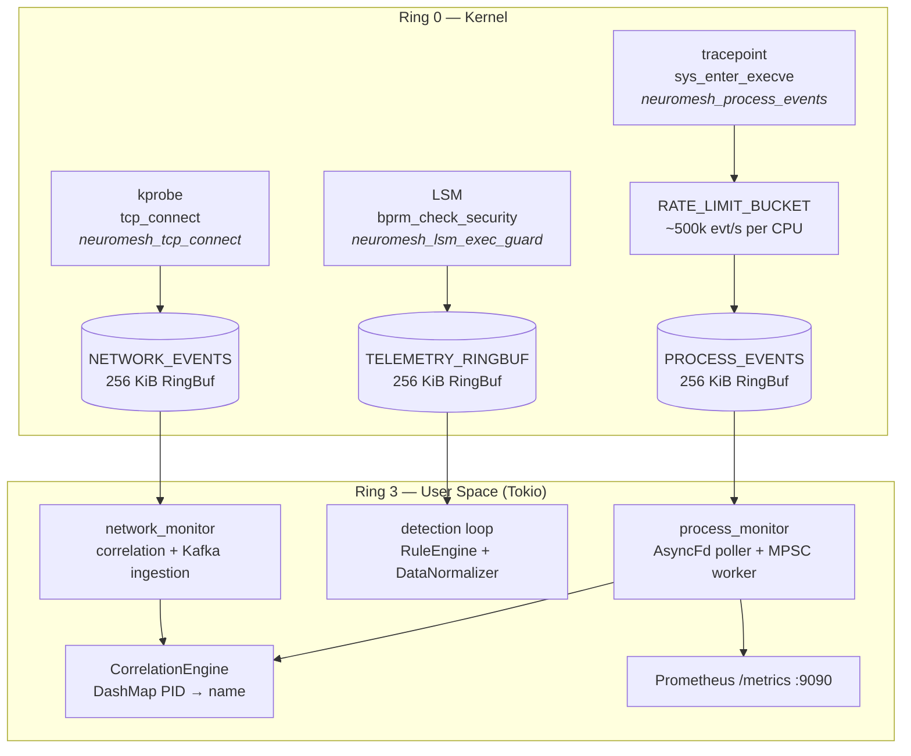

# Neuromesh Security


> **Kernel-native runtime security for Linux and Kubernetes.**
> Ring 0 eBPF telemetry, synchronous LSM enforcement, and asynchronous AI correlation — engineered for production SOCs, not slide decks.

---

## Release posture: `v0.1.0-core`

Neuromesh is transitioning from the marketing-oriented `v0.1.0-alpha` to **`v0.1.0-core`**: an engineering-first release centered on the **eBPF Sensor Core** — a dual-bytecode agent with verifier-tested kernel hooks, bounded backpressure, Prometheus observability, and kernel-independent test coverage.

| Milestone | Focus |
|-----------|-------|
| `v0.1.0-alpha` | Architecture narrative, integration scaffolding |
| **`v0.1.0-core`** | **Production-grade execve telemetry, LSM blocking, load-test harness, threat model, performance baseline** |
| `v0.1.0` (GA) | Full argv capture, Wasm policy hot path, fleet policy sync |

---

## eBPF Sensor Core

The **eBPF Sensor Core** (`apps/agent-ebpf-sensor`) is Neuromesh's Ring 0 runtime agent. It loads **three kernel programs** across **two bytecode artifacts** (C visibility + Rust enforcement) and runs **three parallel user-space consumption pipelines**.

### Kernel hooks (runtime-attached)

| Program | Hook type | Attach target | Bytecode | RingBuf map |
|---------|-----------|---------------|----------|-------------|
| `neuromesh_process_events` | Tracepoint | `syscalls/sys_enter_execve` | C (`sys_exec.bpf.c`) | `PROCESS_EVENTS` |
| `neuromesh_tcp_connect` | Kprobe | `tcp_connect` | C (`network_filter.bpf.c`) | `NETWORK_EVENTS` |
| `neuromesh_lsm_exec_guard` | LSM | `bprm_check_security` | Rust (`ebpf/`) | `TELEMETRY_RINGBUF` |

**Not attached at runtime:** `neuromesh_exec_hook` (Rust tracepoint) — compiled and verifier-tested, reserved for enriched passive exec telemetry in a future release. Production visibility volume flows through the C tracepoint; enforcement and rich lineage flow through LSM.

### Architecture



> **Diagram reference:** [`docs/architecture-decision-records/adr-001-lsm-vs-tracepoint.md`](docs/architecture-decision-records/adr-001-lsm-vs-tracepoint.md)

### Telemetry contracts

| Event struct | Source | Fields populated (v0.1.0-core) |
|--------------|--------|--------------------------------|
| `process_event_t` | C execve tracepoint | `pid` only (verifier-safe skeleton; uid/ppid/comm/filename/ts reserved) |
| `network_event_t` | C tcp_connect kprobe | `pid`, `uid`, `dest_ip`, `dest_port` |
| `SecurityTelemetryEvent` | Rust LSM (blocked exec) | `pid`, `ppid`, `uid`, `euid`, `comm`, `filename` |

### Performance summary

Measured user-space detection latency (Criterion, Linux x86_64, release profile). Kernel syscall overhead and end-to-end EPS require live hardware validation — see [`docs/performance-baseline.md`](docs/performance-baseline.md).

#### User-space detection (measured)

| Component | Per-event latency (median) | Throughput (median) | Harness |
|-----------|---------------------------|---------------------|---------|
| `RuleEngine` (benign whitelist) | **115 ns** | **8.69 Melem/s** | Criterion |
| `RuleEngine` (10k batch) | **~190 ns** amortized | **5.26 Melem/s** | Criterion |
| `DataNormalizer` (single spawn) | **956 ns** | **1.05 Melem/s** | Criterion |
| End-to-end benign path | **~1.07 µs** | RuleEngine + DataNormalizer | Derived |

#### Kernel telemetry pipeline (CI / load-test targets)

| Metric | Standard tier | Extreme tier | Status |
|--------|---------------|--------------|--------|
| **Execve EPS (generator target)** | 100,000/sec | 500,000/sec | Stress harness defined; `#[ignore]` |
| **Kernel rate-limit ceiling** | 500,000/sec per CPU | 500,000/sec per CPU | Implemented (`RATE_LIMIT_BUCKET`) |
| **RingBuf reserve drop counter** | `DROPPED_EVENTS` (network) | — | Kernel-side only |
| **User-space MPSC backpressure** | Channel default 8192 | Tunable via env | Implemented |
| **Syscall latency overhead (execve)** | _TBD_ | _TBD_ | Post-CI: `perf stat` delta |
| **RingBuf drop rate under burst** | _TBD_ | _TBD_ | Post-CI: stress test + Prometheus |
| **Agent CPU utilization (steady state)** | _TBD_ | _TBD_ | Post-CI: `/metrics` + node exporter |
| **Agent CPU utilization (burst)** | _TBD_ | _TBD_ | Post-CI: `execve_stress_test` |

> Placeholders marked _TBD_ are filled by running the load-test methodology in [`docs/performance-baseline.md`](docs/performance-baseline.md) on Linux hardware with the live agent attached. Do not treat placeholders as procurement guarantees.

#### Observability endpoints

| Endpoint | Default | Metrics |
|----------|---------|---------|
| Prometheus | `http://<host>:9090/metrics` | `ebpf_events_processed_total`, `ebpf_events_dropped_total`, `agent_uptime_seconds` |
| Detection stdout | JSON lines | `CRITICAL_ALERT`, `BEHAVIOR_ALERT` |

---

## Dual-Path Architecture

Neuromesh separates security into two layers with explicit latency contracts:

| Path | Mechanism | Latency class | Role |
|------|-----------|---------------|------|
| **Fast Path** | eBPF LSM + tracepoints + user-space rules | Sub-millisecond (kernel) / sub-microsecond (user space) | Block staging-path execution; emit deterministic alerts |
| **Slow Path** | Kafka → GNN inference (`ai-threat-detector`) | Seconds (async) | Lateral movement, anomaly correlation — never blocks syscall hot path |

---

## Open Core Model

Neuromesh follows an **Open Core** strategy: the runtime sensor and deterministic detection logic are Apache 2.0; AI-driven anomaly detection, enterprise integrations, and fleet operations are commercial.

### Community Edition (Open Source)

| Capability | Included |
|------------|----------|
| eBPF Sensor Core (LSM blocking + execve/tcp_connect visibility) | Yes |
| User-space `RuleEngine` (whitelist + blacklist path rules) | Yes |
| `DataNormalizer` spawn-burst detection | Yes |
| Local JSON alert logging (stdout) | Yes |
| Prometheus metrics + health monitor | Yes |
| Integration test farm + Criterion baseline | Yes |
| Kubernetes DaemonSet manifest | Yes |
| MITRE ATT&CK threat model + attack simulation | Yes |

**License:** Apache 2.0 · **Support:** Community (GitHub Issues)

### Enterprise Edition (Commercial)

> **Status key:** *Shipped* — implemented and tested in this repo today. *Partial* —
> some real implementation exists but a required piece is missing (see note).
> *Planned* — not yet implemented; no code exists for this capability yet.

| Capability | Status |
|------------|----------|
| AI / GNN Anomaly Engine (Kafka Slow Path) | Scaffold — rule-based edge-growth heuristic on a `networkx` graph (`ai-threat-detector/src/inference/gnn_evaluator.py`); no ML/GNN model, training, or inference framework is implemented. Planned for a future release. |
| SIEM integrations (Splunk HEC, Datadog, Elastic, Sentinel) | Planned — no integration code exists yet. |
| Post-Quantum Cryptography signed telemetry envelopes | Planned — no PQC (Kyber/Dilithium or otherwise) code exists yet. |
| Fleet Management (multi-cluster policy sync) | Planned — `zt-policy-engine` is currently a single-node policy evaluator; no multi-cluster sync exists yet. |
| OIDC / SAML SSO, audited admin dashboards | Partial — RBAC, session verification, and structured access-decision logging are implemented (`security-dashboard/src/middleware.ts`, `src/lib/auth/rbac.ts`); the OIDC/SAML authentication handshake (callback endpoint, authorization-code/token exchange) is not yet implemented. |
| 24×7 SLA, dedicated TAM, custom MITRE detection packs | Yes |

**Pricing:** [sales@neuromesh.security](mailto:sales@neuromesh.security)

---

## Repository Structure

```
/apps
  agent-ebpf-sensor/     # eBPF Sensor Core — kernel hooks + orchestrator
  ai-threat-detector/    # Kafka → GNN Slow Path
  zt-policy-engine/      # OPA + SPIFFE control plane
  k8s-admission-webhook/ # Validating/mutating admission
  security-dashboard/    # Next.js command center
/deploy
  kubernetes/            # Production DaemonSet manifests
/packages
  neuromesh-common/      # Shared kernel/user-space event types
/docs
  performance-baseline.md
  threat-model.md
  architecture-decision-records/
/scripts
  simulate_attack.sh     # MITRE T1059/T1204 proof-of-value
/tests
  neuromesh-integration-tests/  # Kernel-independent test farm
```

---

## Quickstart

### Prerequisites

| Requirement | Minimum | Notes |
|-------------|---------|-------|
| OS | Linux kernel **5.8+** | RingBuf, BPF map pinning, LSM eBPF |
| Architecture | x86_64 | Primary target; ARM64 planned |
| Rust | **nightly** + `bpf-linker` | Required for Rust eBPF enforcement object |
| Clang | 14+ | C visibility bytecode (`-target bpf`) |
| Privileges | root or `CAP_BPF` + `CAP_PERFMON` + `CAP_SYS_ADMIN` | LSM attach requires BTF from `/sys/kernel/btf/vmlinux` |

### Build and run (native Linux)

```bash
# 0. Kernel-independent tests (no root, no eBPF)
cargo test -p neuromesh-integration-tests
cargo test -p agent-ebpf-sensor --lib

# 1. Install eBPF linker
cargo install bpf-linker

# 2. Build Rust enforcement bytecode + user-space orchestrator
cargo +nightly build --package agent-ebpf-sensor-ebpf \
  --target bpfel-unknown-none -Z build-std=core --release

cargo build -p agent-ebpf-sensor --features orchestrator --release

# 3. Start orchestrator (root required)
RUST_LOG=info sudo -E ./target/release/agent-ebpf-sensor

# 4. Validate telemetry (separate terminal)
curl -s http://127.0.0.1:9090/metrics | grep ebpf_events
./scripts/simulate_attack.sh
```

Expected stdout alerts from `./scripts/simulate_attack.sh`:

- `CRITICAL_ALERT` — execution from `/tmp/` (RuleEngine / LSM path)
- `BEHAVIOR_ALERT` — rapid spawn burst (DataNormalizer)

### Optional: Kafka Slow Path

```bash
export NEUROMESH_KAFKA_BROKERS=localhost:9092
export NEUROMESH_KAFKA_TOPIC=neuromesh.telemetry.v1
export NEUROMESH_NODE_NAME=$(hostname)
```

Kafka export is non-blocking; Fast Path enforcement is unaffected if the broker is unavailable.

### Docker Compose (full stack)

```bash
docker compose up --build
curl -s http://localhost:8080/healthz | jq .
./scripts/simulate_attack.sh
```

> **Note:** `agent-ebpf-sensor` requires `privileged: true`, `pid: host`, and debugfs mounts. Docker Desktop on macOS/Windows cannot attach eBPF programs — use native Linux or a VM.

---

## Production Deployment

### Kubernetes DaemonSet

Deploy one privileged agent pod per Linux node:

```bash
kubectl apply -f deploy/kubernetes/neuromesh-agent.yaml
kubectl rollout status daemonset/neuromesh-agent -n neuromesh-system
kubectl logs -n neuromesh-system -l app.kubernetes.io/name=neuromesh-agent -f
```

#### Node requirements

| Setting | Value | Rationale |
|---------|-------|-----------|
| `hostPID: true` | Required | Process namespace visibility |
| `privileged: true` | Required | eBPF program load + map pin |
| Capabilities | `BPF`, `SYS_ADMIN`, `PERFMON`, `SYS_RESOURCE` | LSM attach, tracepoint, kprobe |
| Volume mounts | `/sys/fs/bpf`, `/sys/kernel/debug`, `/sys/kernel/tracing`, host `/` (ro) | Map pinning, BTF, tracefs |
| `priorityClassName` | `system-node-critical` | Agent survives node pressure |

#### Resource guidance (starting point)

| Profile | CPU request | CPU limit | Memory limit | Notes |
|---------|-------------|-----------|--------------|-------|
| **Standard node** | 100m | 500m | 512Mi | Default manifest values |
| **High execve churn** | 250m | 1000m | 1Gi | CI builders, serverless sidecars |
| **Burst validation** | — | — | — | Run `execve_stress_test` before sizing |

#### Environment variables

| Variable | Default | Purpose |
|----------|---------|---------|
| `NEUROMESH_BPF_PIN_ROOT` | `/sys/fs/bpf/neuromesh` | Map pin path for restart persistence |
| `NEUROMESH_PROCESS_CHANNEL_CAPACITY` | `8192` | User-space execve MPSC depth |
| `NEUROMESH_METRICS_PORT` | `9090` | Prometheus scrape port |
| `NEUROMESH_HEALTH_INTERVAL_SECS` | `5` | Kernel drop counter sampling interval |
| `NEUROMESH_KAFKA_BROKERS` | _(unset)_ | Optional Slow Path export |
| `NEUROMESH_NODE_NAME` | _(unset)_ | Node attribution in telemetry |

#### Production checklist

- [ ] Kernel ≥ 5.8 with `CONFIG_BPF_LSM=y` and BTF available at `/sys/kernel/btf/vmlinux`
- [ ] Prometheus scraping `ebpf_events_processed_total` and `ebpf_events_dropped_total`
- [ ] Alert on sustained drop rate > 0.1% of processed events (tune per workload)
- [ ] Log shipping from agent stdout (JSON alerts) to SIEM
- [ ] Rolling update strategy `maxUnavailable: 1` preserves per-node coverage
- [ ] Pre-release load test: `cargo test -p agent-ebpf-sensor --test execve_stress_test -- --ignored --nocapture`
- [ ] Review [`docs/threat-model.md`](docs/threat-model.md) residual risks for your threat profile

### Graceful shutdown

The orchestrator handles `SIGINT`/`SIGTERM` with a **500 ms drain window** before releasing BPF links. Use preStop hooks or `kubectl delete` grace period ≥ 10s to avoid torn consumers mid-flight.

---

## Documentation index

| Document | Purpose |
|----------|---------|
| [`docs/performance-baseline.md`](docs/performance-baseline.md) | Criterion micro-benchmarks, load-test methodology, Prometheus metrics |
| [`docs/threat-model.md`](docs/threat-model.md) | MITRE ATT&CK mapping, execve evasion surface, mitigations |
| [`docs/architecture-decision-records/adr-001-lsm-vs-tracepoint.md`](docs/architecture-decision-records/adr-001-lsm-vs-tracepoint.md) | LSM vs tracepoint design rationale |

---

*Built for environments where syscall overhead is measured in nanoseconds, not excuses.*
