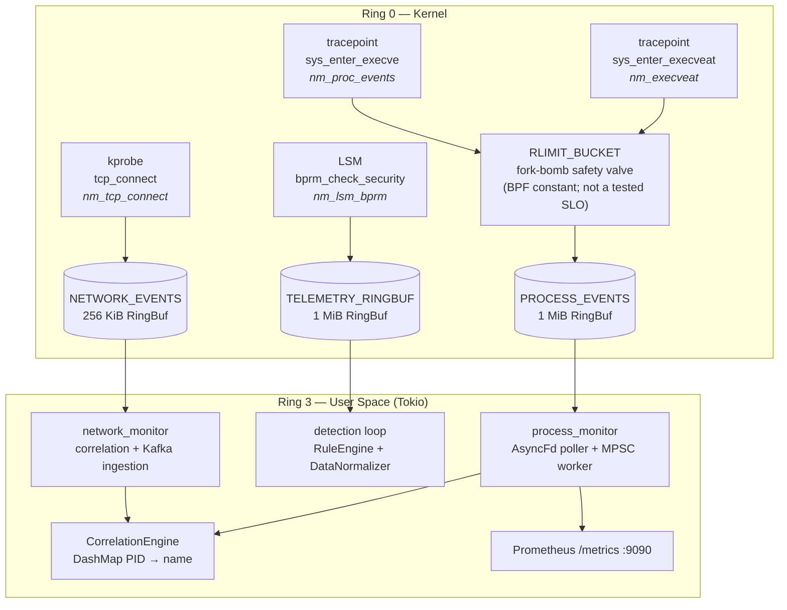

# Neuromesh Security


%20%7C%20GNN%20(scaffold)-blue.svg)
[](https://neuromesh-security.netlify.app/)

> **Kernel-native runtime security for Linux and Kubernetes.**
> Ring 0 eBPF telemetry, synchronous LSM enforcement, and asynchronous AI correlation — engineered for production SOCs, not slide decks.

**Live site / demo:** [https://neuromesh-security.netlify.app/](https://neuromesh-security.netlify.app/)

---

## Release posture: `v0.1.0-core`

Neuromesh is transitioning from the marketing-oriented `v0.1.0-alpha` to **`v0.1.0-core`**: an engineering-first release centered on the **eBPF Sensor Core** — a dual-bytecode agent with verifier-tested kernel hooks, bounded backpressure, Prometheus observability, and kernel-independent test coverage.

| Milestone | Focus |
|-----------|-------|
| `v0.1.0-alpha` | Architecture narrative, integration scaffolding |
| **`v0.1.0-core`** | **Production-grade execve telemetry, LSM blocking, load-test harness, threat model, performance baseline** |
| `v0.1.0` (GA) | Full argv capture, fleet policy sync. Wasm policy hot path remains an intentional deferred scaffold (see Community Edition), not a GA deliverable. |

---

## eBPF Sensor Core

The **eBPF Sensor Core** (`apps/agent-ebpf-sensor`) is Neuromesh's Ring 0 runtime agent. It loads **four kernel programs** across **two bytecode artifacts** (C visibility + Rust enforcement) and runs **three parallel user-space consumption pipelines**.

### Kernel hooks (runtime-attached)

| Program | Hook type | Attach target | Bytecode | RingBuf map |
|---------|-----------|---------------|----------|-------------|
| `nm_proc_events` | Tracepoint | `syscalls/sys_enter_execve` | C (`sys_exec.bpf.c`) | `PROCESS_EVENTS` |
| `nm_execveat` | Tracepoint | `syscalls/sys_enter_execveat` | C (`sys_exec.bpf.c`) | `PROCESS_EVENTS` |
| `nm_tcp_connect` | Kprobe | `tcp_connect` | C (`network_filter.bpf.c`) | `NETWORK_EVENTS` |
| `nm_lsm_bprm` | LSM | `bprm_check_security` | Rust (`ebpf/`) | `TELEMETRY_RINGBUF` |

**Exec visibility covers both syscall entry points.** `nm_execveat` closes the observability gap previously tracked in the threat model: `execveat(2)` — and therefore `fexecve(3)`, which glibc implements as `execveat(fd, "", argv, envp, AT_EMPTY_PATH)` — now reaches `PROCESS_EVENTS` alongside `execve(2)`. Records are distinguished by the `EXEC_FLAG_SYSCALL_EXECVEAT` bit in `ExecEvent::flags`. **Enforcement was never affected:** `nm_lsm_bprm` already covered both syscalls because they share the `bprm_check_security` hook.

**Historical (not a gap):** `neuromesh_exec_hook` was a prototype Rust `sys_enter_execve` tracepoint. It was **removed** in [PR #35](https://github.com/Neuromesh-Security/neuromesh/pull/35) (`dc06aeda`) — it is not in the current enforcement ELF, is not verifier-tested, and is not reserved for a future release. Production exec visibility is entirely the C programs `nm_proc_events` (`sys_enter_execve`) and `nm_execveat` (`sys_enter_execveat`). Enforcement remains Rust `nm_lsm_bprm` (blocked events on `TELEMETRY_RINGBUF`).

### Architecture


```mermaid
flowchart TB
    subgraph kernel["Ring 0 — Kernel"]
        TP["tracepoint<br/>sys_enter_execve<br/><i>nm_proc_events</i>"]
        TPAT["tracepoint<br/>sys_enter_execveat<br/><i>nm_execveat</i>"]
        KP["kprobe<br/>tcp_connect<br/><i>nm_tcp_connect</i>"]
        LSM["LSM<br/>bprm_check_security<br/><i>nm_lsm_bprm</i>"]
        RB1[("PROCESS_EVENTS<br/>1 MiB RingBuf")]
        RB2[("NETWORK_EVENTS<br/>256 KiB RingBuf")]
        RB3[("TELEMETRY_RINGBUF<br/>1 MiB RingBuf")]
        RL["RLIMIT_BUCKET<br/>fork-bomb safety valve<br/>(BPF constant; not a tested SLO)"]
        TP --> RL
        TPAT --> RL
        RL --> RB1
        KP --> RB2
        LSM --> RB3
    end

    subgraph userspace["Ring 3 — User Space (Tokio)"]
        PM["process_monitor<br/>AsyncFd poller + MPSC worker"]
        NM["network_monitor<br/>correlation + Kafka ingestion"]
        DET["detection loop<br/>RuleEngine + DataNormalizer"]
        CORR["CorrelationEngine<br/>DashMap PID → name"]
        MET["Prometheus /metrics :9090"]
        RB1 --> PM --> CORR
        RB2 --> NM --> CORR
        RB3 --> DET
        PM --> MET
    end
```

> **Diagram reference:** [`docs/architecture-decision-records/adr-001-lsm-vs-tracepoint.md`](docs/architecture-decision-records/adr-001-lsm-vs-tracepoint.md)

### Telemetry contracts

| Event struct | Source | Fields populated (v0.1.0-core) |
|--------------|--------|--------------------------------|
| `process_event_t` | C execve tracepoint | `pid` only (verifier-safe skeleton; uid/ppid/comm/filename/ts reserved) |
| `network_event_t` | C tcp_connect kprobe | `pid`, `uid`, `dest_ip`, `dest_port` |
| `SecurityTelemetryEvent` | Rust LSM (blocked exec) | `pid`, `ppid`, `uid`, `euid`, `comm`, `filename` |

### Performance summary

Measured user-space detection latency (Criterion, Linux x86_64, release profile). **Live-tested execve throughput after [PR #160](https://github.com/Neuromesh-Security/neuromesh/pull/160) is `average_eps=816`** (30 s standard, 1 vCPU, generator-bound; sweep-best `average_eps=738` at 8 workers). Historical pre-#160: 962 (band 880–962, zero RingBuf drops). See [`docs/performance-baseline.md`](docs/performance-baseline.md) §2.3. That is the documented ceiling, not 100k or 500k.

#### User-space detection (measured)

| Component | Per-event latency (median) | Throughput (median) | Harness |
|-----------|---------------------------|---------------------|---------|
| `RuleEngine` (benign whitelist) | **115 ns** | **8.69 Melem/s** | Criterion |
| `RuleEngine` (10k batch) | **~190 ns** amortized | **5.26 Melem/s** | Criterion |
| `DataNormalizer` (single spawn) | **956 ns** | **1.05 Melem/s** | Criterion |
| End-to-end benign path | **~1.07 µs** | RuleEngine + DataNormalizer | Derived |

#### Kernel telemetry pipeline (live-tested)

| Metric | Value | Status |
|--------|-------|--------|
| **Execve EPS (tested live, generator-bound)** | **`average_eps=816`** (post-#160 30 s standard); sweep-best **738** | 1 vCPU; `worker_model=std::thread`; `host_parallelism=1`. Historical pre-#160: 962 (3 runs, zero RingBuf drops) |
| **Headroom vs typical K8s worker** | **~16×** vs ~50 execve/s at 816 | Derived from Kubernetes 110-pods/node envelope + probe defaults — [`performance-baseline.md`](docs/performance-baseline.md) §2.3.1 |
| **Kernel token-bucket (fork-bomb valve)** | 500,000/sec per CPU (`RATE_LIMIT_BUCKET`) | Implemented BPF constant — **not a tested SLO**, not a production-justified target |
| **RingBuf reserve drop counter** | `DROPPED_EVENTS` (network) | Kernel-side only |
| **User-space MPSC backpressure** | Channel default 8192 | Implemented; kept up at historical ~900 EPS (post-#160 drops not in paste-back) |
| **Syscall latency overhead (execve)** | _TBD_ | Optional `perf stat` delta — not required for the 816 EPS claim |
| **RingBuf drop rate at tested load** | **0%** (pre-#160 ~900 EPS, 3 runs) | Post-#160 Prometheus drops **not** in paste-back |
| **Agent CPU utilization (idle)** | **0.400%** of 1 core | Measured (Issue #100) |
| **Agent CPU utilization (tested burst)** | **~38–41%** of 1 core during burst | Measured (`pidstat`) |

#### Observability endpoints

| Endpoint | Default | Metrics |
|----------|---------|---------|
| Prometheus | `http://<host>:9090/metrics` | `ebpf_events_processed_total`, `ebpf_events_dropped_total`, `agent_uptime_seconds` |
| Detection stdout | JSON lines | `CRITICAL_ALERT`, `BEHAVIOR_ALERT` |

---

## Dual-Path Architecture

Neuromesh separates security into two layers with explicit latency contracts:

| Path | Mechanism | Latency class | Role |
|------|-----------|---------------|------|
| **Fast Path** | eBPF LSM + tracepoints + user-space rules | Sub-millisecond (kernel) / sub-microsecond (user space) | Block staging-path execution; emit deterministic alerts |
| **Slow Path** | Kafka → GNN inference (`ai-threat-detector`) | Seconds (async) | Lateral movement, anomaly correlation — never blocks syscall hot path |

`POST /v1/evaluate` on `zt-policy-engine` is a **control-plane advisory** API (OPA + SPIFFE). It is **not** the execve enforcement source of truth — the LSM + policy-bundle `PATH_DENY_LIST` are. See [`SECURITY.md`](SECURITY.md) and [`apps/zt-policy-engine/README.md`](apps/zt-policy-engine/README.md).

---

## Security Verification

The following claims are from **internal engineering verification** on a real Ubuntu 24.04 **x86_64** Linux kernel (~6.8-class) with BPF LSM enabled. They are **not** a third-party security audit, certification, or external assessment. Verified kernel/architecture scope is **only x86_64 on ~6.8 / ~6.17** (droplet + CI) — see [Verified kernel / architecture support](#verified-kernel--architecture-support).

Reproducible evidence lives in-repo:

| Evidence | Script / reference |
|----------|-------------------|
| LSM enforcement survives agent death | [`scripts/manual_verify_lsm_pin.sh`](scripts/manual_verify_lsm_pin.sh) — [Issue #44](https://github.com/Neuromesh-Security/neuromesh/issues/44) / [PR #72](https://github.com/Neuromesh-Security/neuromesh/pull/72) |
| Runtime tamper detection of pinned artifacts | [`scripts/manual_verify_runtime_integrity.sh`](scripts/manual_verify_runtime_integrity.sh) — [PR #74](https://github.com/Neuromesh-Security/neuromesh/pull/74) / [PR #76](https://github.com/Neuromesh-Security/neuromesh/pull/76) |
| Identity exceptions end-to-end (auto-correlation) | [`scripts/manual_verify_identity_2bii_correlation.sh`](scripts/manual_verify_identity_2bii_correlation.sh) — [Issue #95](https://github.com/Neuromesh-Security/neuromesh/issues/95) / [PR #98](https://github.com/Neuromesh-Security/neuromesh/pull/98); see also 2b-i teardown [`scripts/manual_verify_identity_invalidation.sh`](scripts/manual_verify_identity_invalidation.sh) |

**What was verified live (not unit-test-only):**

1. **Kernel LSM enforcement survives agent process termination.** With the LSM link and deny maps pinned under bpffs, blacklisted-path execution remained denied after `kill -9` of the agent process. Enforcement is kernel-resident for the pinned lifetime; it does not depend on the user-space orchestrator staying alive. Proven on a live BPF-LSM kernel via the manual pin script above (Issue #44 / PR #72).

2. **Runtime tamper detection of pinned enforcement artifacts.** Post-start removal of a pinned deny-map artifact is detected by the integrity monitor and surfaced (metrics / alert path) within the configured integrity interval. Verified live via the runtime integrity script (PR #74 / PR #76).

3. **Identity exceptions — auto-correlation end-to-end (Slice 2a + 2b).** On a single-node k3s droplet with the host agent (not nested), a real 3-container pod was SPIFFE-gated into `IDENTITY_ALLOW_CGROUPS` without manual seed; map entries cleared on Pod DELETE (`reason=pod_delete`) and on PE allowlist revoke while the pod was still Running (`reason=pe_allowlist_revoke`). Confirmed via agent log lines and `identity_correlator_invalidation_total` metrics. Single-sample latencies from that run (not p50/p99): insert ~2.3 s, delete ~0.9 s, revoke ~11.8 s (PE sync-gated by design). Manual seeding is **not** required for this verified path. Details and honest residuals: [`docs/threat-model.md`](docs/threat-model.md).

**Scope limits (read before treating this as a procurement claim):**

- These results are **operator-reproducible engineering checks**, not an external audit, certification, or multi-node production soak under real load.
- They cover the specific failure modes exercised by the scripts above (pin survival after abrupt agent death; detection of post-start pin / on-disk path manipulation; identity auto-insert / delete / PE revoke on one k3s node). They do not imply complete coverage of every residual risk in [`docs/threat-model.md`](docs/threat-model.md).
- Latency numbers above are **one droplet sample** each — recommend repeated runs before any SLA or procurement claim.
- **Architecture:** x86_64 only. **ARM64 is unsupported / unverified** (no current infrastructure access to test).
- **Kernels:** live-tested on **~6.8 / ~6.17** only. **5.15 and 6.1 LTS are unverified** — not silently assumed from the 5.8+ feature floor.

---

## Open Core Model

Neuromesh follows an **Open Core** strategy: the runtime sensor and deterministic detection logic are Apache 2.0; AI-driven anomaly detection, enterprise integrations, and fleet operations are commercial.

### Community Edition (Open Source)

| Capability | Included |
|------------|----------|
| eBPF Sensor Core (LSM blocking + execve/tcp_connect visibility) | Yes |
| User-space `RuleEngine` (whitelist + blacklist path rules) | Yes |
| Wasm policy hot-path on LSM (`wasm_policy.rs`) | Scaffold — `WasmPolicyEngine` is constructed at startup and held; load/evaluate are not wired (`NotImplemented` / always Allow). Intentional deferred initiative, not abandoned code. Out of scope for v0.1.0-core ([`docs/threat-model.md`](docs/threat-model.md) §1); planned v0.2.0 ([`docs/RELEASE_v0.1.0-core.md`](docs/RELEASE_v0.1.0-core.md)). Multi-week, not a sprint item. |
| `DataNormalizer` spawn-burst detection | Yes |
| Local JSON alert logging (stdout) | Yes |
| Prometheus metrics + health monitor | Yes |
| Integration test farm + Criterion baseline | Yes |
| Kubernetes DaemonSet manifest | Yes |
| MITRE ATT&CK threat model + attack simulation | Yes |

**License:** Apache 2.0 · **Support:** Community (GitHub Issues)

### Enterprise Edition (Commercial)

> **Status key:** *Shipped* — implemented and tested in this repo today. *Partial* —
> some real implementation exists but a required piece is missing (see note).
> *Planned* — not yet implemented; no code exists for this capability yet.

| Capability | Status |
|------------|----------|
| AI / GNN Anomaly Engine (Kafka Slow Path) | Scaffold — rule-based edge-growth heuristic on a `networkx` graph (`ai-threat-detector/src/inference/gnn_evaluator.py`); no ML/GNN model, training, or inference framework is implemented. Planned for a future release. |
| SIEM integrations (Splunk HEC, Datadog, Elastic, Sentinel) | Planned — no integration code exists yet. |
| Post-Quantum Cryptography signed telemetry envelopes | Planned — no PQC (Kyber/Dilithium or otherwise) code exists yet. |
| Fleet Management (multi-cluster policy sync) | Planned — `zt-policy-engine` is currently a single-node policy evaluator; no multi-cluster sync exists yet. |
| OIDC / SAML SSO, audited admin dashboards | Partial — RBAC, session verification, and structured access-decision logging are implemented (`security-dashboard/src/middleware.ts`, `src/lib/auth/rbac.ts`); the OIDC/SAML authentication handshake (callback endpoint, authorization-code/token exchange) is not yet implemented. |
| 24×7 SLA, dedicated TAM, custom MITRE detection packs | Planned — no support staff, TAM, or productized custom detection-pack service exists today (solo-maintained project). No committed timeline. |

**Pricing:** [draganflaviusfx@gmail.com](mailto:draganflaviusfx@gmail.com)

---

## Repository Structure

```
/apps
  agent-ebpf-sensor/     # eBPF Sensor Core — kernel hooks + orchestrator
  ai-threat-detector/    # Kafka → GNN Slow Path
  zt-policy-engine/      # OPA + SPIFFE control plane
  k8s-admission-webhook/ # Validating/mutating admission
  security-dashboard/    # Next.js command center
/deploy
  kubernetes/            # Production DaemonSet manifests
/packages
  neuromesh-common/      # Shared kernel/user-space event types
/docs
  performance-baseline.md
  threat-model.md
  architecture-decision-records/
/scripts
  simulate_attack.sh     # MITRE T1059/T1204 proof-of-value
/tests
  neuromesh-integration-tests/  # Kernel-independent test farm
```

---

## Quickstart

### Prerequisites

| Requirement | Minimum | Notes |
|-------------|---------|-------|
| OS | Feature floor: Linux **5.8+** (`CONFIG_BPF_LSM`, RingBuf, BTF). **Verified live: ~6.8 / ~6.17 only.** | 5.8+ is a feature floor, not a support claim. See [Verified kernel / architecture support](#verified-kernel--architecture-support). |
| Architecture | **x86_64 only** | **ARM64 is unsupported / unverified.** `bpfel-unknown-none` is not an ARM64 product claim. |
| Rust | **nightly-2026-07-17** + `bpf-linker` **0.10.4** | Required for Rust eBPF enforcement object (pinned; see `apps/agent-ebpf-sensor/ebpf/rust-toolchain.toml`, Issue #53) |
| Clang | 14+ | C visibility bytecode (`-target bpf`) |
| Privileges | root or `CAP_BPF` + `CAP_PERFMON` + `CAP_SYS_ADMIN` | LSM attach requires BTF from `/sys/kernel/btf/vmlinux` |

### Verified kernel / architecture support

**Verified live today: x86_64 only, on ~6.8 / ~6.17.** That is the entire kernel/architecture support claim. Evidence: Ubuntu 24.04-class droplet with BPF LSM, plus CI `ubuntu-22.04 / ~6.8-azure` and `ubuntu-24.04 / ~6.17-azure`.

**Explicitly unverified — do not silently assume these work:**

- **ARM64** is unsupported. There is no current infrastructure access to test it (our cloud provider does not offer ARM64 droplets). Closing this needs a different provider (or equivalent ARM64 lab), not a compile-target inference.
- **Kernel 5.15 and 6.1 LTS** are unverified. No standard cloud image is currently available for honest live testing: Debian 12 (the stock 6.1 image) was deprecated by the provider; Ubuntu 22.04 cloud images default to HWE **6.8**, not GA **5.15**. Closing this needs a different infrastructure provider or a custom-built older-kernel test environment.

**Why kernel version matters here (not a generic caveat):** After `PATH_DENY_KEY_BYTES` went from 16 to 32 ([Issue #134](https://github.com/Neuromesh-Security/neuromesh/issues/134) / [PR #135](https://github.com/Neuromesh-Security/neuromesh/pull/135)), LLVM stopped fully unrolling the inner prefix compare and emitted a counted/bounded loop with a back-edge. The LSM deny scan is nested (`PATH_DENY_MAX_ENTRIES` 64 × inner 32-byte compare). Linux 5.3 made counted loops *legal*; that is **not** equivalent verifier maturity to the ~6.8 / ~6.17 kernels that actually loaded this object. CI accepted the 32-byte object only on those two Azure HWE kernels. A real 5.15 LSM kernel has never loaded it. Static `llvm-objdump` instruction count is not verifier `insn_processed`. Details: [`docs/threat-model.md`](docs/threat-model.md) §1 / §7 / [Issue #157](https://github.com/Neuromesh-Security/neuromesh/issues/157).

### Build and run (native Linux)

```bash
# 0. Kernel-independent tests (no root, no eBPF)
cargo test -p neuromesh-integration-tests
cargo test -p agent-ebpf-sensor --lib

# 1. Install pinned eBPF toolchain + linker (matches CI / Issue #53)
rustup toolchain install nightly-2026-07-17 --component rust-src
cargo install bpf-linker --version 0.10.4 --locked

# 2. Build Rust enforcement bytecode + user-space orchestrator
#    (rust-toolchain.toml under apps/agent-ebpf-sensor/ebpf also selects this nightly)
cargo +nightly-2026-07-17 build --package agent-ebpf-sensor-ebpf \
  --manifest-path apps/agent-ebpf-sensor/ebpf/Cargo.toml \
  --target bpfel-unknown-none -Z build-std=core --release

cargo build -p agent-ebpf-sensor --features orchestrator --release

# 3. Start orchestrator (root required)
#    Optional: sync deny-list prefixes from zt-policy-engine (Phase 1).
#    If unset, the agent enforces bootstrap defaults only (/tmp/, /dev/shm/, /var/tmp/).
#    export NEUROMESH_ZT_POLICY_ENGINE_URL=http://127.0.0.1:8080
RUST_LOG=info sudo -E ./target/release/agent-ebpf-sensor

# 4. Validate telemetry (separate terminal)
curl -s http://127.0.0.1:9090/metrics | grep ebpf_events
./scripts/simulate_attack.sh
```

Expected stdout alerts from `./scripts/simulate_attack.sh`:

- `CRITICAL_ALERT` — execution from `/tmp/` (RuleEngine / LSM path)
- `BEHAVIOR_ALERT` — rapid spawn burst (DataNormalizer)

### Optional: Kafka Slow Path

```bash
export NEUROMESH_KAFKA_BROKERS=localhost:9092
export NEUROMESH_KAFKA_TOPIC=neuromesh.telemetry.v1
export NEUROMESH_NODE_NAME=$(hostname)
```

Kafka export is non-blocking; Fast Path enforcement is unaffected if the broker is unavailable.

### Docker Compose (full stack)

```bash
docker compose up --build
curl -s http://localhost:8080/healthz | jq .
./scripts/simulate_attack.sh
```

> **Note:** `agent-ebpf-sensor` requires `privileged: true`, `pid: host`, and debugfs mounts. Docker Desktop on macOS/Windows cannot attach eBPF programs — use native Linux or a VM.

---

## Production Deployment

### Kubernetes DaemonSet

Deploy one privileged agent pod per Linux node:

```bash
kubectl apply -f deploy/kubernetes/neuromesh-agent.yaml
kubectl rollout status daemonset/neuromesh-agent -n neuromesh-system
kubectl logs -n neuromesh-system -l app.kubernetes.io/name=neuromesh-agent -f
```

#### Node requirements

| Setting | Value | Rationale |
|---------|-------|-----------|
| `hostPID: true` | Required | Process namespace visibility |
| `privileged: true` | Required | eBPF program load + map pin |
| Capabilities | `BPF`, `SYS_ADMIN`, `PERFMON`, `SYS_RESOURCE` | LSM attach, tracepoint, kprobe |
| Volume mounts | `/sys/fs/bpf`, `/sys/kernel/debug`, `/sys/kernel/tracing`, host `/` (ro) | Map pinning, BTF, tracefs |
| `priorityClassName` | `system-node-critical` | Agent survives node pressure |

#### Resource guidance (starting point)

| Profile | CPU request | CPU limit | Memory limit | Notes |
|---------|-------------|-----------|--------------|-------|
| **Standard node** | 100m | 500m | 512Mi | Default manifest values |
| **High execve churn** | 250m | 1000m | 1Gi | CI builders, serverless sidecars |
| **Burst validation** | — | — | — | Run `execve_stress_test` before sizing |

#### Environment variables

| Variable | Default | Purpose |
|----------|---------|---------|
| `NEUROMESH_BPF_PIN_ROOT` | `/sys/fs/bpf/neuromesh` | Map pin path for restart persistence |
| `NEUROMESH_PROCESS_CHANNEL_CAPACITY` | `8192` | User-space execve MPSC depth |
| `NEUROMESH_METRICS_PORT` | `9090` | Prometheus scrape port |
| `NEUROMESH_HEALTH_INTERVAL_SECS` | `5` | Kernel drop counter sampling interval |
| `NEUROMESH_KAFKA_BROKERS` | _(unset)_ | Optional Slow Path export |
| `NEUROMESH_NODE_NAME` | _(unset)_ | Node attribution in telemetry |

#### Production checklist

- [ ] Host is **x86_64** on a **verified** kernel class (~6.8 / ~6.17) with `CONFIG_BPF_LSM=y` and BTF at `/sys/kernel/btf/vmlinux`. Do **not** treat ARM64, 5.15, or 6.1 as supported. The 5.8+ feature floor is not a live-test claim — see [Verified kernel / architecture support](#verified-kernel--architecture-support).
- [ ] Prometheus scraping `ebpf_events_processed_total` and `ebpf_events_dropped_total`
- [ ] Alert on sustained drop rate > 0.1% of processed events (tune per workload)
- [ ] Log shipping from agent stdout (JSON alerts) to SIEM
- [ ] Rolling update strategy `maxUnavailable: 1` preserves per-node coverage
- [ ] Pre-release load test: `cargo test -p agent-ebpf-sensor --test execve_stress_test -- --ignored --nocapture`
- [ ] Review [`docs/threat-model.md`](docs/threat-model.md) residual risks for your threat profile

### Graceful shutdown

The orchestrator handles `SIGINT`/`SIGTERM` with a **500 ms drain window** before releasing BPF links. Use preStop hooks or `kubectl delete` grace period ≥ 10s to avoid torn consumers mid-flight.

---

## Contributing

Install the **required** pre-commit hook before your first commit:

```bash
git config core.hooksPath scripts/hooks
```

The hook runs `cargo fmt`, `cargo clippy -D warnings`, and `shellcheck` on
staged Rust/shell files and **blocks the commit** if tooling is missing or
checks fail. See [`CONTRIBUTING.md`](CONTRIBUTING.md) for toolchain requirements
and troubleshooting.

## Documentation index

| Document | Purpose |
|----------|---------|
| [`CONTRIBUTING.md`](CONTRIBUTING.md) | Pre-commit hook install, local lint gates, CI parity |
| [`docs/performance-baseline.md`](docs/performance-baseline.md) | Criterion micro-benchmarks, load-test methodology, Prometheus metrics |
| [`docs/threat-model.md`](docs/threat-model.md) | MITRE ATT&CK mapping, execve evasion surface, mitigations |
| [`docs/architecture-decision-records/adr-001-lsm-vs-tracepoint.md`](docs/architecture-decision-records/adr-001-lsm-vs-tracepoint.md) | LSM vs tracepoint design rationale |

---

*Built for environments where syscall overhead is measured in nanoseconds, not excuses.*
